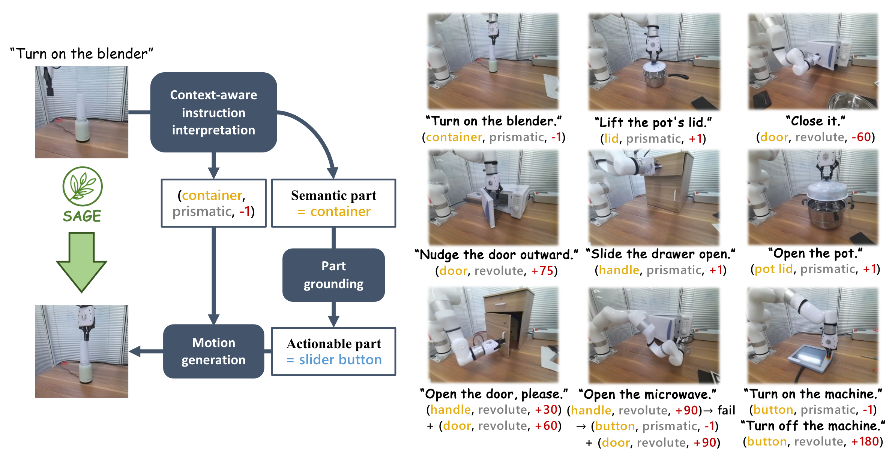
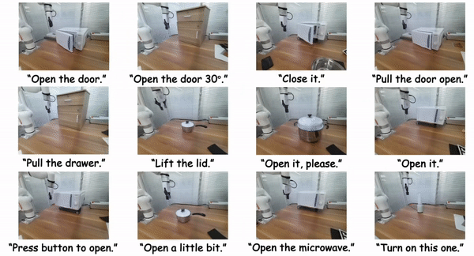

<h2 align="center">
  <b>SAGE🌿: Bridging Semantic and Actionable Parts for Generalizable Articulated-Object Manipulation under Language Instructions</b>

  <b><i>
  <!-- Under Review -->
  </i></b>


<div align="center">
    <!-- <a href="https://arxiv.org/abs/2312.01307" target="_blank">
    </a> -->
    <a href="https://arxiv.org/abs/2312.01307" target="_blank">
    </a>
    <a href="https://geometry.stanford.edu/projects/sage/" target="_blank">
    </a>
</div>
</h2>

This is the official repository of [**SAGE🌿: Bridging Semantic and Actionable Parts for Generalizable Articulated-Object Manipulation under Language Instructions**](https://arxiv.org/abs/2312.01307).

For more information, please visit our [**project page**](https://geometry.stanford.edu/projects/sage/).





## Benchmark & Code & Instructions
Coming soon...

## Citation
If you find our work useful in your research, please consider citing:

```
@misc{geng2023sage,
      title={SAGE: Bridging Semantic and Actionable Parts for GEneralizable Articulated-Object Manipulation under Language Instructions}, 
      author={Haoran Geng and Songlin Wei and Congyue Deng and Bokui Shen and He Wang and Leonidas Guibas},
      year={2023},
      eprint={2312.01307},
      archivePrefix={arXiv},
      primaryClass={cs.RO}
}
```

## Contact
If you have any questions, please open a github issue or contact us:

Haoran Geng: ghr@stu.pku.edu.cn
